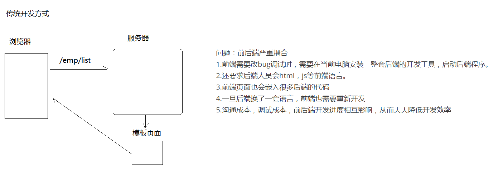
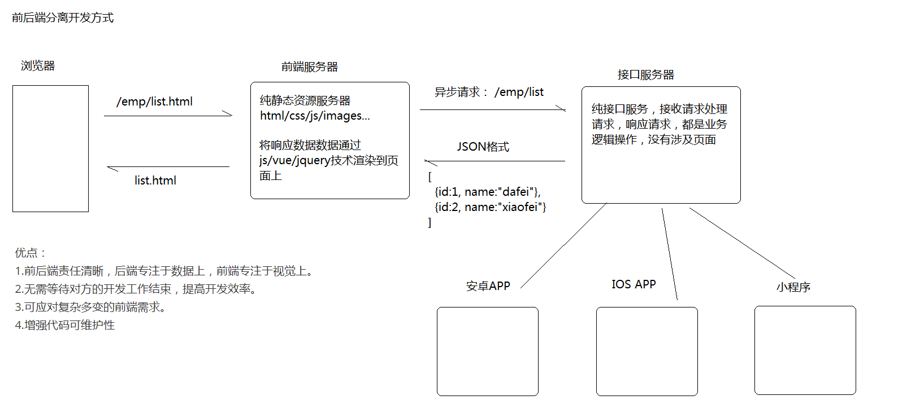
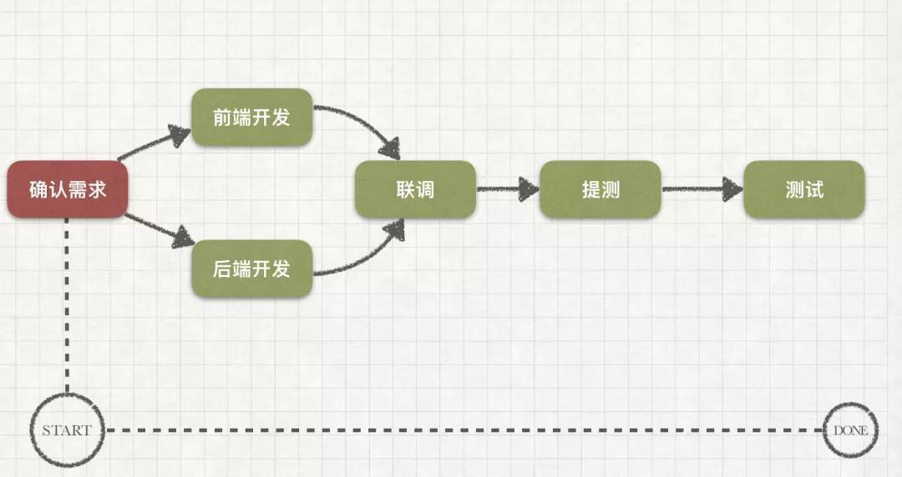
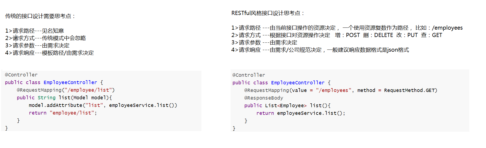
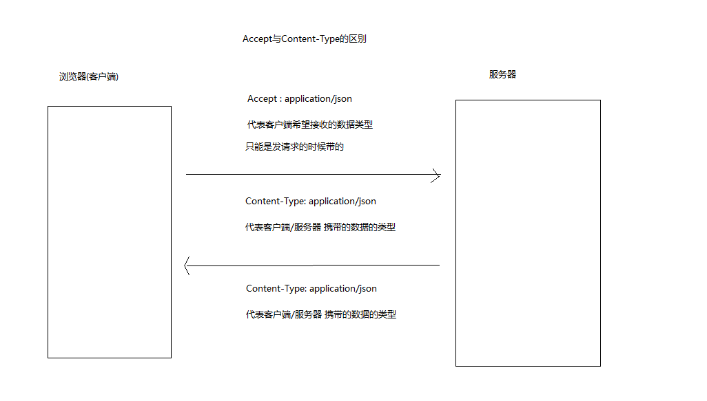

# RESTful

配套视频：

【3个半小时让你精通Restful API开发，不信来试一下~】 https://www.bilibili.com/video/BV1Ps4y1J7Ve/?share_source=copy_web&vd_source=fffc49a66c25469755e54e5ddf015f57

本文主要是介绍RESTful以及其一些思想。

## 什么是 API

API（Application Programming Interface，[应用程序](https://baike.baidu.com/item/%E5%BA%94%E7%94%A8%E7%A8%8B%E5%BA%8F)接口）是一些预先定义的[函数](https://baike.baidu.com/item/%E5%87%BD%E6%95%B0)，或指软件系统不同组成部分衔接的约定。 [1]  目的是提供[应用程序](https://baike.baidu.com/item/%E5%BA%94%E7%94%A8%E7%A8%8B%E5%BA%8F)与开发人员基于某[软件](https://baike.baidu.com/item/%E8%BD%AF%E4%BB%B6)或硬件得以访问一组[例程](https://baike.baidu.com/item/%E4%BE%8B%E7%A8%8B)的能力，而又无需访问原码，或理解内部工作[机制](https://baike.baidu.com/item/%E6%9C%BA%E5%88%B6)的细节。

研发人员A开发了软件A，研发人员B正在研发软件B。

有一天，研发人员B想要调用软件A的部分功能来用，但是他又不想从头看一遍软件A的源码和功能实现过程，怎么办呢？

研发人员A想了一个好主意：我把软件A里你需要的功能打包好；你把这个包放在软件B里，就能直接用我的方法了！

其中，API就是研发人员A说的那个方法。

### Web 发展阶段

Web 开发技术的发展可以粗略划分成以下几个阶段

- **静态内容阶段**：在这个最初的阶段，使用 Web 的主要是一些研究机构。Web 由大量的静态 HTML 文档组成。
- **CGI 程序阶段**：在这个阶段，Web 服务器增加了一些编程 API。通过这些 API 编写的应用程序，可以向客户端提供一些动态变化的内容。。
- **脚本语言阶段**：在这个阶段，服务器端出现了 ASP、PHP、JSP、ColdFusion 等支持 session 的脚本语言技术，浏览器端出现了 Java Applet、JavaScript 等技术。使用这些技术，可以提供更加丰富的动态内容。
- **瘦客户端应用阶段**：在这个阶段，在服务器端出现了独立于 Web 服务器的应用服务器。同时出现了 Web MVC 开发模式，各种 Web MVC 开发框架逐渐流行，并且占据了统治地位。基于这些框架开发的 Web 应用，通常都是瘦客户端应用，因为它们是在服务器端生成全部的动态内容。
- **RIA 应用阶段**：在这个阶段，出现了多种 RIA（Rich Internet Application）技术，大幅改善了 Web 应用的用户体验。应用最为广泛的 RIA 技术是 DHTML+Ajax。Ajax 技术支持在不刷新页面的情况下动态更新页面中的局部内容。同时诞生了大量的 Web 前端 DHTML 开发库，例如 Prototype、Dojo、ExtJS、jQuery/jQuery UI 等等。
- **移动 Web 应用阶段**：在这个阶段，出现了大量面向移动设备的 Web 应用开发技术。除了 Android、iOS、Windows Phone 等操作系统平台原生的开发技术之外，基于 HTML5 的开发技术也变得非常流行。

### 传统 VS 前后端分离

**传统的开发模式**

前端写好静态的html页面交给后端开发，后端把html改成模板，然后使用模板引擎去套模板，比如jsp，freemarker等
后端人员在开发过程中如果发现页面有问题，要返回给前端修改，前端再交给后端，直至功能实现。

**问题：**前后端严重耦合

1. 前端需要改bug调试时，需要在当前电脑安装一整套后端的开发工具，启动后端程序。
2. 还要求后端人员会html，js等前端语言。
3. 前端页面也会嵌入很多后端的代码
4. 一旦后端换了一套语言，前端也需要重新开发
5. 沟通成本，调试成本，前后端开发进度相互影响，从而大大降低开发效率



**前后端分离**

前后端分离并不只是开发模式，也是web应用的一种架构模式。
在开发阶段，前后端人员约定好数据交互接口，即可并行开发与测试。

前端开发完成可以独自进行mock测试，后端也可以使用postman等接口测试工具进行测试。
最后可进行功能联调测试。

**优点：**

1. 前后端责任清晰，后端专注于数据上，前端专注于视觉上。
2. 无需等待对方的开发工作结束，提高开发效率。
3. 可应对复杂多变的前端需求。
4. 增强代码可维护性





## RESTful接口设计

### 存在原因

web2.0阶段的出现，客户端将不仅限于PC浏览器，可能是移动APP，也可能是小程序，这就要求服务端能提供一套统一的API接口，不同类型的客户端基于相同的协议/规则就能来调用该API接口并获取预期的数据。

此时核心：如何设计一套科学的API接口？

不同开发者对API接口的设计习惯不同 , 比如可能会出现这种情况

```java
新增员工:
http://localhost/employee/save
http://localhost/employee/add
http://localhost/employee/new
http://localhost/employee/xinzeng
http://localhost/employee/append
http://localhost/employee?cmd=add

而且发送的请求方式以及响应结果也比较可能随意 
```

### RESTful风格

REST是一种设计API接口规则(风格)，因其具有简单、易读、易用的特点，在web项目中非常受欢迎。在设计接口时，如果满足rest约束条件和原则的应用程序或设计就称其为RESTful 应用。

### 约束规则

回想一下，传统的web接口(请求映射方法)设计需要考虑几个要点。

以员工列表为例子。

```java
@Controller
public class EmployeeController {
    @RequestMapping("/employee/list")
    public String list(Model model){
        model.addAttribute("list", employeeService.list())
        return "employee/list";
    }
}
```

#### 传统接口设计

设计传统web接口时考虑：

1. **请求路径：**一般采用见名知意的方式，比如：/employee/list
2. **请求方式：**不在意，@RequestMapping注解可以接受任意请求方式，包括:GET POST
3. **请求参数：**没有固定，根据接口的功能而定， 可以说是由需求决定
4. **请求响应：**没有固定，由需求决定，可以是Json格式也可以页面模板。

#### RESTful接口设计

以员工列表为例子。

```java
@Controller
public class EmployeeController {
    @RequestMapping(value = "/employees", method = RequestMethod.GET)
	@ResponseBody
    public List<Employee> list(){
        return employeeService.list();
    }
}
```

1. **请求路径：**

   不再是见名知意的方式，而是由操作的资源决定，一般采用资源名称复数形式。

   比如接口操作对象(资源)是员工，路径可设计为： 

   > /employees

   问题来了，何为资源？

   **一切皆为资源**

   RESTful眼中，互联网上，一切皆为资源，并且，每个资源都有一个唯一的资源定位符（URI）。

   一张图片是一个资源：

   https://c-ssl.duitang.com/uploads/item/201810/17/20181017111458_dqioq.jpg

   一张网页是一个资源：

   https://www.baidu.com/

   一个请求路径是一个资源：

   http://localhost:8080/employee?id=1

   回归到代码，url http://localhost:8080/employee?id=1  表示查询数据库中id=1的员工信息，这个员工信息就是restful中描述的资源，一般资源都不会只有一个，就像员工不仅仅只有id=1的数据，大多都是以复数，所以RESTful 约定：针对接口要操作资源统一使用复数。

   ```java
   @RequestMapping("/employees")
   public class EmployeeController{
   
   }
   ```

   看看下面例子：

   http://www.langfeiyes.cn/depts  部门资源

   https://api.example.com/v1/zoos：动物园资源
   https://api.example.com/v1/animals：动物资源
   https://api.example.com/v1/employees：饲养员资源

   看别人写的restful风格接口
   http://docs.jiguang.cn/jmessage/server/rest_api_im/

   

   **最后大白话总结：RESTful接口设计-路径一般就是操作实体对象复数**

   

2. **请求方式：**

   传统接口设计方式，使用见名知意设计路径，可以从路径上看出接口对资源操作，而RESTful风格接口使用资源复数作为路径，就无法从路径上看出接口对资源操作，那该怎么办？

   RESTful风格在HTTP请求方法上做文章，约定：

   **GET**（SELECT）：从服务器取出资源（一项或多项）。
   **POST**（CREATE）：在服务器新建一个资源。
   **PUT**（UPDATE）：在服务器更新资源（客户端提供改变后的完整资源）。PUT更新整个对象 
   **PATCH**（UPDATE）：在服务器更新资源（客户端提供改变的属性【补丁】）。 PATCH更新个别属性  
   **DELETE**（DELETE）：从服务器删除资源。

   //了解

   HEAD：获得一个资源的元数据，比如一个资源的hash值或者最后修改日期； 
   OPTIONS：获得客户端针对一个资源能够实施的操作；(获取该资源的api(能够对资源做什么操作的描述))

   **传统的路径见名知意  =  RESTful 路径 + 请求方式**

    

   **示例**

   传统方式：

   http://www.langfeiyes.cn/employee/list

   http://www.langfeiyes.cn/employee/get?id=1

   http://www.langfeiyes.cn/employee/save?name=xx

   http://www.langfeiyes.cn/employee/update?id=1&name=xx

   http://www.langfeiyes.cn/employee/delete?id=1

   

   RESTful方式：

   http://www.langfeiyes.cn/employees
   新增：POST
   更新：PUT
   删除：DELETE
   查询：GET

   GET /zoos：列出所有动物园 
   POST /zoos：新建一个动物园
   GET /zoos/{id}：获取某个指定动物园的信息 
   PUT /zoos/{id}：更新某个指定动物园的信息（提供该动物园的全部信息）
   PATCH /zoos/{id}：更新某个指定动物园的信息（提供该动物园的部分信息）
   DELETE /zoos/{id}：删除某个动物园 
   GET /zoos/{id}/animals：列出某个指定动物园的所有动物 

   获取某个部门的所有员工 

   GET /employee/getByDeptId 以前的 ,比较随意

   GET /departments/{id}/employees  restful风格

3. **请求参数：**

   没有固定，根据接口的功能而定， 可以说是由需求决定

4. **请求响应：**

   RESTful对响应值，还是做了细致的约定的：

   GET /collection：返回资源对象的列表（数组）

   GET /collection/resource：返回单个资源对象

   POST /collection：返回新生成的资源对象

   PUT /collection/resource：返回完整的资源对象

   PATCH /collection/resource：返回完整的资源对象

   DELETE /collection/resource：返回一个空文档

**以上数据返回都使用Json格式。**

> 真实开发，具体响应什么数据，以公司规定/操作需求需要为主。



### 相关拓展

#### HTTP响应状态码

**200** OK - [GET]：服务器成功返回用户请求的数据。

**201** CREATED - [POST/PUT/PATCH]：用户新建或修改数据成功。

**202** Accepted - [*]：表示一个请求已经进入后台排队（异步任务）

**204** NO CONTENT - [DELETE]：用户删除数据成功。

**400** INVALID REQUEST - [POST/PUT/PATCH]：用户发出的请求有错误，服务器没有进行新建或修改数据的操作，该操作是幂等的。

**401** Unauthorized - [*]：表示用户没有权限（令牌、用户名、密码错误）。

**403** Forbidden - [*] 表示用户得到授权（与401错误相对），但是访问是被禁止的。

**404** NOT FOUND - [*]：用户发出的请求针对的是不存在的记录，服务器没有进行操作，该操作是幂等的。

**406** Not Acceptable - [GET]：用户请求的格式不可得（比如用户请求JSON格式，但是只有XML格式）。

410 Gone -[GET]：用户请求的资源被永久删除，且不会再得到的。

**422** Unprocesable entity - [POST/PUT/PATCH] 当创建一个对象时，发生一个验证错误。

**500** INTERNAL SERVER ERROR - [*]：服务器发生错误，用户将无法判断发出的请求是否成功。

#### 资源表现形式

比如，文本可以用txt格式表现，也可以用HTML格式、XML格式、JSON格式表现，甚至可以采用二进制格式；图片可以用JPG格式表现，也可以用PNG格式表现。

它的具体表现形式，应该在HTTP请求的头信息中用Accept和Content-Type字段指定，这两个字段才是对"表现"的描述。

```http
accept:application/json 
content-type:application/json 
```

**Accept与Content-Type的区别:**

1. Accept属于请求头， Content-Type属于实体头。

   1. Http报头分为通用报头，请求报头，响应报头和实体报头。
   2. 请求方的`http`报头结构：通用报头|请求报头|实体报头。
   3. 响应方的`http`报头结构：通用报头|响应报头|实体报头。

2. Accept代表发送端（客户端）希望接受的数据类型。 
   比如：

   ```http
   Accept：application/json; 
   ```


   代表客户端希望接受的数据类型是`json`类型,后台返回`json`数据

3. Content-Type代表发送端（客户端|服务器）发送的实体数据的数据类型。比如：

   ```http
   Content-Type：application/json;
   ```

    代表发送端发送的数据格式是`json`, 后台就要以这种格式来接收前端发过来的数据。

   

### 使用注意

REST只是一种设计风格 , 而不是标准 , 只是提供了一组设计原则和约束条件，具体操作结合公司要求/项目要求。

## RESTful 框架

- SpringMVC 
- jersey 
- play

## API 测试工具

- Postman
- Insomnia

# RESTful 接口练习

## 项目准备

## 接口设计

## 参数路径拓展

## 页面请求接口

# RESTful 接口简化

# RequestMapping 注解属性

# 总结

#课后练习


